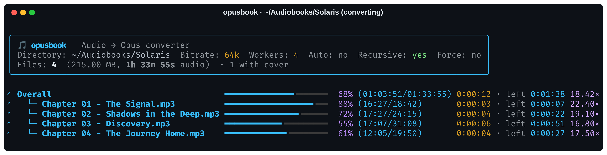
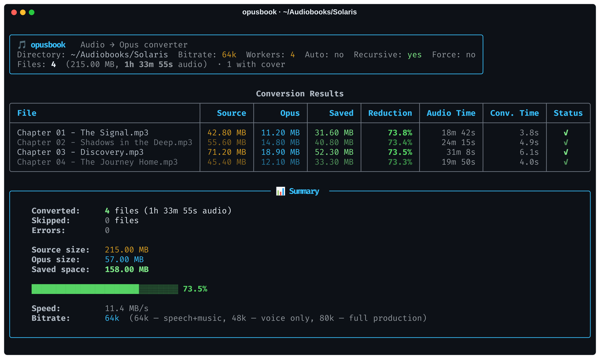
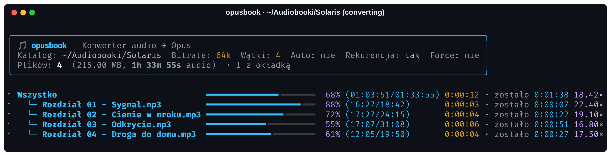
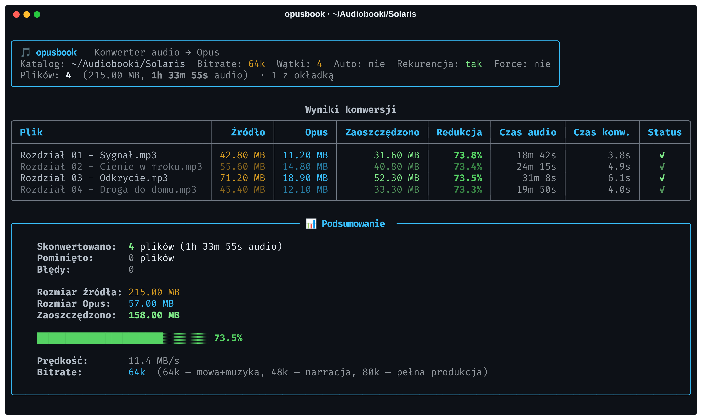

# 🎵 opusbook

> 🎧 Fast, multi-threaded audio-to-Opus converter for audiobooks and podcasts. Typical savings: ~60–75% for lossy sources (MP3/M4B 128k → Opus 64k); up to ~90% for lossless (FLAC/WAV → Opus) with pristine voice quality.
>
> 🇵🇱 Szybki, wielowątkowy konwerter audio do formatu Opus dla audiobooków i podcastów. Typowe oszczędności: ~60–75% dla źródeł stratnych (MP3/M4B 128k → Opus 64k); do ~90% dla bezstratnych (FLAC/WAV → Opus) przy zachowaniu krystalicznej jakości mowy.

[ 🇬🇧 English ](#-english) • [ 🇵🇱 Polski ](#-polski)

---

## 🇬🇧 English

A command-line tool that converts audio files (**MP3, M4B, M4A, FLAC, AAC, WAV, OGG, WMA**) into **Opus**. Tailored for audiobooks, podcasts, and radio plays to achieve substantial storage savings (typically 60–75% for lossy sources, more for FLAC/WAV) without perceptible loss in speech quality.

Features a colorful terminal interface (`rich`), interactive bitrate selection, multi-core batch processing, and automatic channel optimization.





### 🌟 Key Features

- 🎧 **Broad format support:** Converts `.mp3`, `.m4b`, `.m4a`, `.flac`, `.aac`, `.wav`, `.ogg`, `.wma` to `.opus` using `ffmpeg` (`libopus`, VBR, `-application audio`).
- 🎯 **Interactive bitrate picker:** Terminal menu with arrow navigation (48k / 64k / 80k) or quick CLI flag (`-b 64k`).
- 🧠 **Smart `--auto` mode:** Detects channels automatically (mono → 32k, stereo → selected bitrate).
- 📁 **Recursive scanning (`-r`):** Traverses deep audiobook folder hierarchies.
- ⚡ **Multi-threading (`-j N`):** Parallel transcoding with individual and aggregate progress bars (`rich`).
- 🖼️ **Cover art extraction:** Extracts embedded covers to JPEG `cover.jpg` (sidecar) for Audiobookshelf and media players. Video streams are not copied into `.opus` (audio-only, first stream `0:a:0`).
- 📊 **Summary table:** Reports saved megabytes, size reduction percentage, and wall-clock encoding speed.
- 🛡️ **Safety & cleanup:** `--delete` (removes source files only after successful conversion), `--keep`, `--force`, `--dry-run`. `--delete` and `--keep` are mutually exclusive. Failed outputs are deleted so a retry works without `--force`.
- 🤖 **Non-TTY resilient:** No-TTY fallback to 64k bitrate and batch output (ideal for cron jobs and headless scripts). Delete prompt defaults to keep when stdin is not a TTY.

### 🚀 Installation

**Requirements:** Python 3.10+ and `ffmpeg` **with `libopus`** + `ffprobe` (same package on most distros) installed on your system. Check with `ffmpeg -encoders | grep opus`.

#### Global CLI via `pipx` or `uv` (Recommended)

```bash
pipx install git+https://github.com/patientone-io/opusbook.git
# or with uv:
uv tool install git+https://github.com/patientone-io/opusbook.git
```

#### From source in a virtualenv

```bash
git clone https://github.com/patientone-io/opusbook.git
cd opusbook
python3 -m venv .venv && source .venv/bin/activate
pip install -e .
```

### 💡 Usage Examples

```bash
# 1. Convert current directory with default 64k bitrate
opusbook .

# 2. Recursive conversion with 80k bitrate (for audio plays with music/SFX)
opusbook audiobooks/ -r -b 80k

# 3. Auto-bitrate (mono 32k, stereo 64k) and remove source files upon success
opusbook audiobooks/ -r --auto --delete

# 4. Dry run: preview planned ffmpeg commands without encoding
opusbook audiobooks/ -r --dry-run

# 5. Convert a single file (also works without -r)
opusbook audiobooks/chapter01.m4b -b 64k

# 6. Check version
opusbook --version
```

### ⚙️ CLI Options

| Argument | Description | Default |
| :--- | :--- | :--- |
| `PATH` | Path to directory with audio files, or a single audio file | `.` |
| `-b, --bitrate` | Target Opus bitrate (`48k`, `64k`, `80k`, etc.) | Interactive picker, or `64k` when stdin is not a TTY |
| `-j, --jobs` | Number of concurrent ffmpeg worker processes (≥1) | `min(4, CPU cores)` |
| `-r, --recurse` | Recursively search subdirectories | `False` |
| `--auto` | Auto-optimize bitrate (mono → 32k, stereo → from `-b`) | `False` |
| `-f, --force` | Overwrite existing `.opus` files | `False` |
| `--delete` | Delete input files after successful conversion (no prompt) | `False` |
| `--keep` | Keep input files, skip interactive confirmation | `False` (no flag → ask interactively, keep when non-TTY) |
| `--dry-run` | Display scheduled ffmpeg commands without executing | `False` |
| `-l, --lang` | Interface language (`auto`, `en`, `pl`) | `auto` (system locale) |
| `-V, --version` | Show version and exit | — |

> Without `--delete`/`--keep` opusbook asks interactively whether to delete sources. In cron/CI (no TTY) it keeps files.

### 🧪 Development & tests

```bash
pip install -e ".[dev]"
pytest
ruff check .
python opusbook.py --help
```

### 🆘 Troubleshooting

| Symptom | Fix |
| :--- | :--- |
| `ffmpeg not found` / `ffprobe not found` | `sudo apt install ffmpeg` / `brew install ffmpeg` / `winget install ffmpeg`; ensure both binaries are on `PATH` |
| `Unknown encoder 'libopus'` | Your ffmpeg lacks libopus — reinstall full/static build, then `ffmpeg -encoders \| grep opus` |
| Interactive picker hangs in cron | Pass `-b 64k` explicitly; non-TTY auto-defaults to 64k |
| `.opus` larger than source | Normal for tiny/low-bitrate sources or WAV→high-bitrate; summary warns in red |
| Cover missing in player | opusbook writes sidecar `cover.jpg` (Audiobookshelf picks it up); embedded art is not muxed into Opus |

---

## 🇵🇱 Polski

Narzędzie wiersza poleceń do konwersji plików audio **(MP3, M4B, M4A, FLAC, AAC, WAV, OGG, WMA) → Opus**. Zaprojektowane specjalnie z myślą o audiobookach, słuchowiskach i podcastach, zapewniające ogromną oszczędność miejsca (typowo 60–75% dla źródeł stratnych, więcej dla FLAC/WAV) przy zachowaniu doskonałej jakości mowy.

Oferuje kolorowy interfejs terminalowy (`rich`), interaktywny wybór bitrate'a, wielowątkowe przetwarzanie oraz automatyczną optymalizację kanałów (mono/stereo).





### 🌟 Główne Funkcje

- 🎧 **Wsparcie dla wielu formatów:** Konwertuje `.mp3`, `.m4b`, `.m4a`, `.flac`, `.aac`, `.wav`, `.ogg`, `.wma` do formatu `.opus` przez `ffmpeg` (`libopus`, VBR, `-application audio`).
- 🎯 **Interaktywny wybór bitrate'a:** Wygodne menu w terminalu (48k / 64k / 80k) lub przełącznik `-b 64k`.
- 🧠 **Inteligentny tryb `--auto`:** Automatyczne rozpoznawanie kanałów (mono → 32k, stereo → wybrany bitrate).
- 📁 **Rekurencyjne skanowanie (`-r`):** Przeszukuje całe drzewa folderów z audiobookami.
- ⚡ **Wielowątkowość (`-j N`):** Równoległa konwersja z indywidualnymi i łącznymi paskami postępu (`rich`).
- 🖼️ **Ekstrakcja okładek:** Zapis osadzonych grafik do JPEG `cover.jpg` (sidecar) dla Audiobookshelf i odtwarzaczy. Wideo nie trafia do `.opus` (tylko audio, pierwszy strumień `0:a:0`).
- 📊 **Tabela podsumowania:** Prezentuje zaoszczędzone MB, procent redukcji i prędkość kodowania (wall-clock).
- 🛡️ **Opcje czyszczenia:** `--delete` (usuwa pliki źródłowe po udanej konwersji), `--keep`, `--force`, `--dry-run`. Flagi `--delete`/`--keep` wykluczają się. Nieudane pliki `.opus` są usuwane, więc ponowienie działa bez `--force`.
- 🤖 **Odporność na brak TTY:** Automatyczny fallback do 64k i trybu wsadowego (skrypty cron i CI). Pytanie o usuwanie domyślnie zachowuje pliki bez TTY.

### 🚀 Instalacja

**Wymagania:** Python 3.10+ oraz zainstalowany w systemie `ffmpeg` **z `libopus`** + `ffprobe`. Sprawdź: `ffmpeg -encoders | grep opus`.

#### Globalne CLI przez `pipx` lub `uv` (Zalecane)

```bash
pipx install git+https://github.com/patientone-io/opusbook.git
# lub za pomocą uv:
uv tool install git+https://github.com/patientone-io/opusbook.git
```

#### Ze źródeł w wirtualnym środowisku

```bash
git clone https://github.com/patientone-io/opusbook.git
cd opusbook
python3 -m venv .venv && source .venv/bin/activate
pip install -e .
```

### 💡 Przykłady Użycia

```bash
# 1. Konwersja w bieżącym folderze (domyślny bitrate 64k)
opusbook .

# 2. Rekurencyjna konwersja słuchowiska z bitratem 80k
opusbook sluchowisko/ -r -b 80k

# 3. Auto-bitrate (mono 32k, stereo 64k) z usunięciem plików źródłowych
opusbook audiobook/ -r --auto --delete

# 4. Tryb symulacji (podgląd planowanych komend ffmpeg bez uruchamiania)
opusbook audiobook/ -r --dry-run

# 5. Konwersja pojedynczego pliku
opusbook audiobook/rozdzial01.m4b -b 64k

# 6. Wersja
opusbook --version
```

### ⚙️ Parametry CLI

| Argument | Opis | Domyślnie |
| :--- | :--- | :--- |
| `ŚCIEŻKA` | Ścieżka do katalogu z plikami audio lub pojedynczego pliku | `.` |
| `-b, --bitrate` | Bitrate wyjściowy (`48k`, `64k`, `80k` itp.) | Interaktywny picker, `64k` bez TTY |
| `-j, --jobs` | Liczba równoległych procesów ffmpeg (≥1) | `min(4, rdzenie CPU)` |
| `-r, --recurse` | Rekurencyjne przeszukiwanie podkatalogów | `False` |
| `--auto` | Auto-optymalizacja (mono → 32k, stereo → z `-b`) | `False` |
| `-f, --force` | Nadpisywanie istniejących plików `.opus` | `False` |
| `--delete` | Usunięcie plików wejściowych po udanej konwersji (bez pytania) | `False` |
| `--keep` | Zachowanie plików wejściowych bez pytania | `False` (bez flagi → pytanie; bez TTY → keep) |
| `--dry-run` | Tryb symulacji: wyświetlenie zaplanowanych komend bez konwersji | `False` |
| `-l, --lang` | Język interfejsu (`auto`, `pl`, `en`) | `auto` (zmienna systemowa) |
| `-V, --version` | Pokaż wersję i zakończ | — |

> Bez `--delete`/`--keep` program pyta interaktywnie o usunięcie. W cron/CI (bez TTY) pliki są zachowywane.

### 🧪 Development i testy

```bash
pip install -e ".[dev]"
pytest
ruff check .
python opusbook.py --help
```

### 🆘 Rozwiązywanie problemów

| Objaw | Rozwiązanie |
| :--- | :--- |
| `ffmpeg not found` / `ffprobe not found` | `sudo apt install ffmpeg` / `brew install ffmpeg` / `winget install ffmpeg`; oba binarne muszą być w `PATH` |
| `Unknown encoder 'libopus'` | ffmpeg bez libopus — zainstaluj pełny build, sprawdź `ffmpeg -encoders \| grep opus` |
| Picker wiesza się w cronie | Podaj `-b 64k`; bez TTY domyślnie 64k |
| `.opus` większy niż źródło | Normalne dla małych źródeł / WAV→wysoki bitrate; podsumowanie ostrzega na czerwono |
| Brak okładki w odtwarzaczu | Zapisywany jest sidecar `cover.jpg` (wykrywa go Audiobookshelf); art nie jest muxowany do Opusa |

---

## 👤 Author & Contact / Autor i kontakt

- **Author:** [patientone](https://github.com/patientone-io)
- **Website:** [patientone.uk](https://patientone.uk)
- **Email:** `contact@patientone.uk`

---

## 📄 License / Licencja

- **EN:** Released under the **MIT License**. See [LICENSE](LICENSE) for details.
- **PL:** Projekt udostępniany na licencji **MIT**. Szczegóły w pliku [LICENSE](LICENSE).

